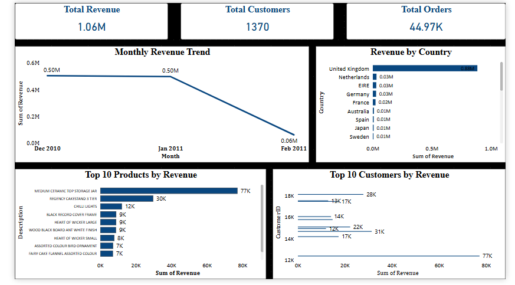
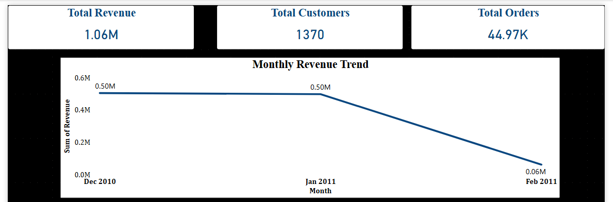
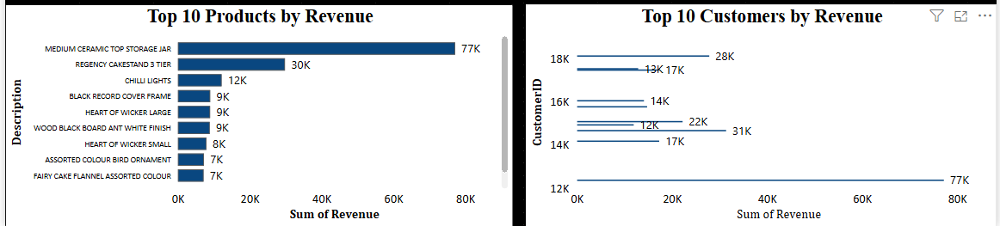
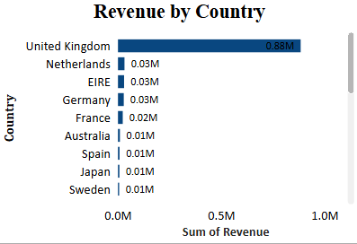

# 🛒 Ecommerce Sales Analysis

## 📊 Project Overview

This project performs end-to-end data analysis on ecommerce sales data using SQL, Excel, and Power BI to generate meaningful business insights.

---

## 🛠 Tools & Technologies

* SQL – Data cleaning and analysis
* Excel – Data processing and pivot analysis
* Power BI – Dashboard creation and visualization

---

## 📂 Project Structure

* **data/** → Raw dataset
* **sql/** → Data cleaning and analysis queries
* **excel/** → Processed data and analysis
* **powerbi/** → Final dashboard file
* **images/** → Dashboard screenshots

---

## 📈 Key Insights

* Revenue peaked in December and dropped significantly in February
* Top 10 products contribute a major portion of total revenue
* A small number of customers generate most of the revenue
* Revenue distribution varies across different countries

---

## 📊 Dashboard Features

* KPI Cards (Total Revenue, Customers, Orders)
* Monthly Revenue Trend
* Top 10 Products by Revenue
* Top 10 Customers by Revenue
* Revenue by Country

---

## 📷 Dashboard Preview

---

## 📁 Files Included

* SQL scripts (.sql)
* Excel analysis file (.xlsx)
* Power BI dashboard (.pbix)
