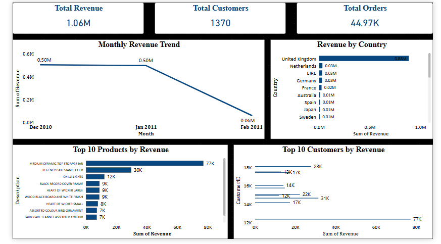
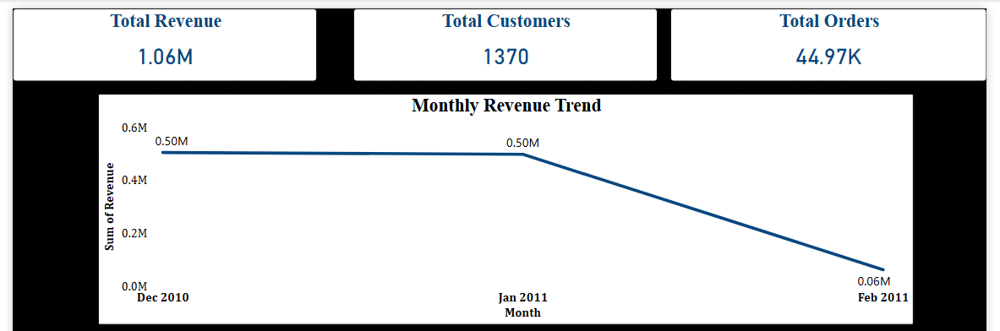
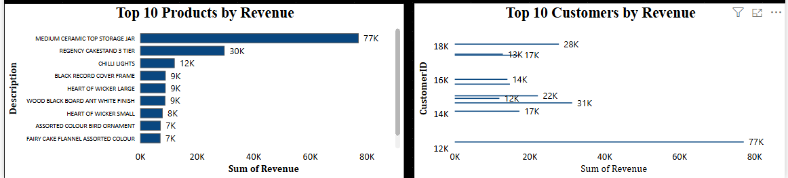
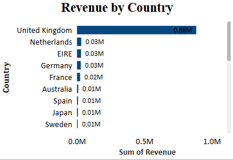

# 📊 Ecommerce Sales Analysis Dashboard


## 📖 Overview

An end-to-end ecommerce sales analytics project that transforms raw transactional data into meaningful business insights using **SQL**, **Excel**, and **Power BI**.

The project follows a structured analytics workflow covering data import, cleaning, analysis, and dashboard development to support data-driven decision-making.

---

## 🎯 Objectives

- Import and prepare raw ecommerce sales data
- Clean and validate the dataset using SQL
- Analyze sales performance and customer behavior
- Build an interactive Power BI dashboard
- Generate actionable business insights

---

## 🛠 Tech Stack

- **SQL (MySQL)**
- **Microsoft Excel**
- **Power BI**

---

## 📂 Repository Structure

```text
├── data/
│   └── raw_ecommerce_data.csv
│
├── sql/
│   ├── 01_data_import.sql
│   ├── 02_data_cleaning.sql
│   └── 03_data_analysis.sql
│
├── excel/
│   └── ecommerce_analysis.xlsx
│
├── powerbi/
│   └── ecommerce_dashboard.pbix
│
├── images/
│   ├── dashboard_overview.png
│   ├── kpi_trend.png
│   ├── product_customer.png
│   └── region.png
│
└── README.md
```

---

## 💡 Skills Demonstrated

- SQL Data Cleaning
- Exploratory Data Analysis (EDA)
- Data Visualization
- KPI Reporting
- Excel Pivot Analysis
- Business Intelligence
- Interactive Dashboard Development

---

# 📸 Dashboard Walkthrough

## Dashboard Overview

A consolidated dashboard providing insights into revenue, orders, customers, and overall business performance.



---

## KPI & Revenue Trends

Monitors key business metrics and monthly revenue trends to evaluate sales performance.



---

## Product & Customer Analysis

Highlights top-performing products and high-value customers based on revenue contribution.



---

## Regional Sales Analysis

Compares sales performance across different countries to identify regional trends and high-performing markets.



---

## 📈 Key Business Insights

- Identified monthly sales trends and seasonal revenue patterns.
- Evaluated revenue contribution across products and customer segments.
- Identified top-performing products and high-value customers.
- Compared sales performance across different geographical regions.
- Built an interactive dashboard to support business reporting and decision-making.

---

## 🚀 Technical Highlights

- Built an end-to-end analytics workflow using SQL, Excel, and Power BI.
- Performed data cleaning and exploratory analysis before visualization.
- Designed an interactive dashboard to monitor KPIs and sales performance.
- Converted raw transactional data into actionable business insights through business intelligence reporting.
